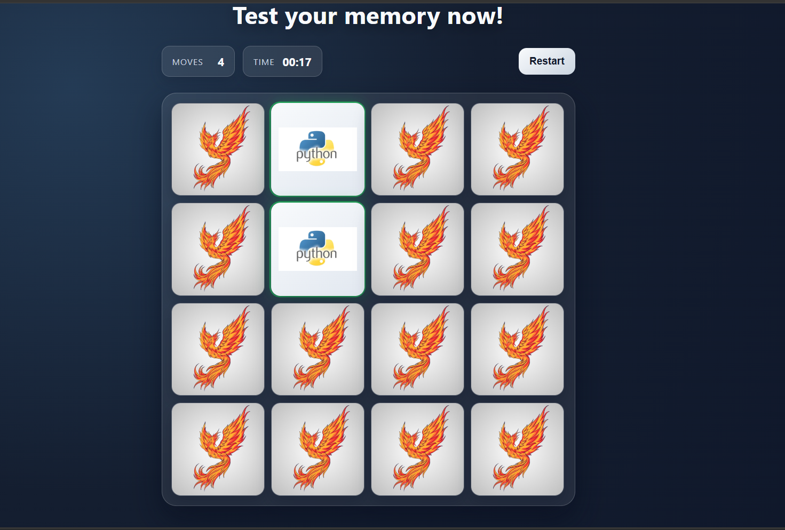

# Memory Card Game

A simple and modern memory game built with vanilla JavaScript.

## Description

Flip cards two by two and try to find matching pairs.
The game includes:

- card shuffle at start/restart
- move counter
- timer
- restart button

## Stack

- HTML5
- CSS3
- JavaScript

## How to play

1. Click the first card.
2. Click a second card.
3. If both cards match, they stay visible.
4. If they do not match, they flip back.
5. Match all pairs to win.

## Run locally

Open `index.html` in your browser.

## UI screenshots

